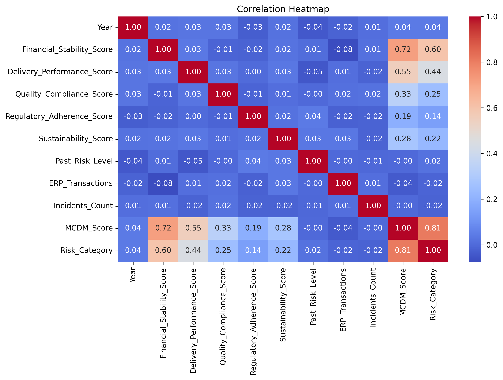
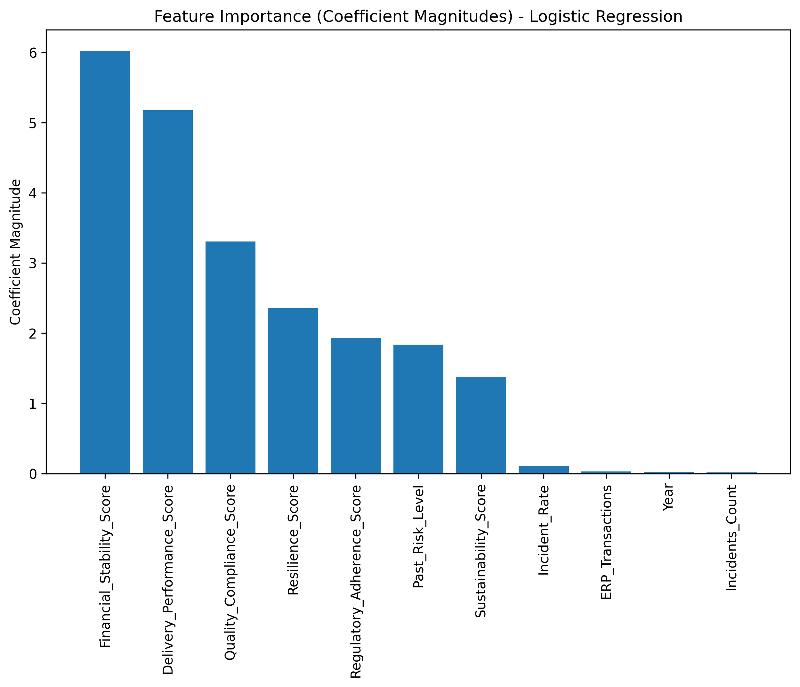

# supplier-risk-classification-for-procurement-using-machine-learning

## Objective
This project applies a machine learning classification model to identify supplier risk levels based on operational and financial indicators.

The main purpose is to support procurement decision-making by helping teams recognize suppliers that may require closer monitoring, further review, or more cautious sourcing decisions.

In real supply chain and procurement operations, supplier-related problems can affect:
- delivery reliability
- compliance and service quality
- operational continuity
- long-term supplier stability

Procurement teams often work with many supplier records and multiple performance indicators at the same time. A simple machine learning model can help turn those indicators into a clearer risk signal, making supplier review more structured and more data-driven.

## Model Approach
This project uses **Logistic Regression** to classify suppliers into risk categories using supplier-related operational and financial features.

Main input variables include:
- Financial Stability Score
- Delivery Performance Score
- Quality Compliance Score
- Regulatory Adherence Score
- Sustainability Score
- Past Risk Level

Feature scaling was applied before training the model, and model performance was evaluated using classification metrics and visual outputs.

## Evidence from Model Outputs

### 1. Confusion Matrix
The confusion matrix shows how well the model classifies supplier risk categories.

**What this chart helps show:**  
It provides evidence that the model can separate supplier risk groups consistently within this dataset.

**Why this matters in practice:**  
In a procurement context, this means supplier data can be converted into a more structured screening signal rather than being reviewed only manually. A model like this can help procurement teams quickly identify which supplier records deserve closer attention.

**Practical supply chain value:**  
If a supplier record is classified as higher risk, teams can use that result as an early signal for:
- deeper supplier review
- additional validation before sourcing decisions
- stronger monitoring of delivery and compliance performance

---

### 2. Feature Importance
The feature importance chart shows which variables contribute most strongly to supplier risk classification.

**What this chart helps show:**  
It indicates that supplier risk is not driven by one isolated factor only. Operational and financial indicators such as delivery performance, financial stability, and quality compliance play an important role in the classification result.

**Why this matters in practice:**  
This is useful in supply chain and procurement because supplier evaluation should not rely on price or one metric alone. The chart supports the idea that supplier risk is multi-dimensional.

**Practical supply chain value:**  
This helps procurement teams understand which supplier dimensions deserve more attention, for example:
- weak delivery performance may suggest execution risk
- poor financial stability may suggest longer-term supply risk
- weak compliance or quality performance may indicate operational disruption risk

## Key Business Insights
- Supplier risk can be assessed more effectively when operational and financial indicators are evaluated together rather than separately.
- Delivery performance, financial stability, and quality-related variables appear to be important signals in supplier risk classification.
- A classification model can help procurement teams move from descriptive review to more structured risk screening.
- In practice, this kind of model could support supplier monitoring by highlighting records that may require closer review before procurement decisions are made.

## Potential Application in Supply Chain
This model is not a replacement for procurement judgment, but it can serve as a useful decision-support tool.

Possible practical uses include:
- supplier risk screening before selection or renewal
- identifying suppliers that may need additional review
- supporting procurement monitoring with a more structured data-driven signal
- helping procurement teams prioritize attention when supplier records are large in volume

## Limitation
Although the model performs strongly on this dataset, real-world supplier risk classification would require validation on more diverse and more complex supplier data before practical deployment.

## Files
- `supplier_risk.csv` – source dataset
- `supplier_risk_classification.ipynb` – machine learning notebook
- `confusion_matrix.png` – classification result visualization
- `feature_importance.png` – model interpretation chart

## Tools Used
- Python
- Pandas
- Scikit-learn
- Matplotlib
- Seaborn
